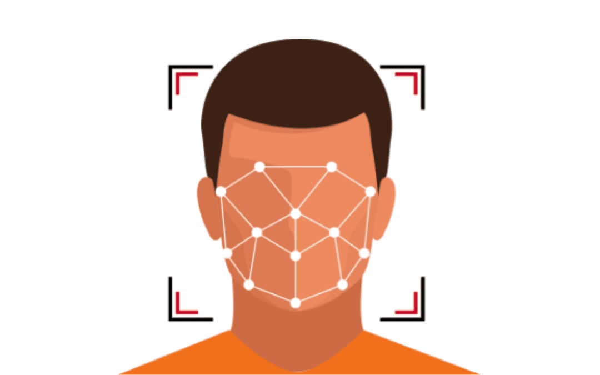
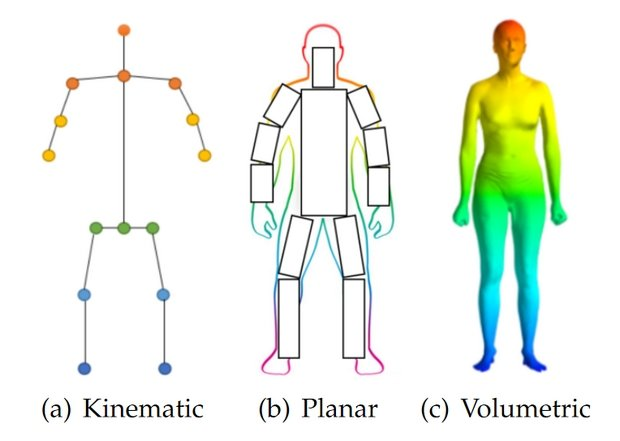

# DJI-TELLO-Face-Tracking
This Repo contains face tracking using the opencv library, using the haar cascade algorithm   

## Presentation Overview 
the following presentation is a resume for the following project : 

https://docs.google.com/presentation/d/11yXiGXrZFX3IeuA4ZvAwquNZ0gmLqcDu/edit#slide=id.p1

## Presentation 
This presentation explores methods for implementing face tracking and gesture control on a drone. It focuses on using computer vision techniques for detection, tracking, and gesture recognition to enable intuitive, hands-free control of drone movements.

## Part I :
The first part uses the **Haar Cascade classifier** algorithm to detect faces within the drone's camera feed, after which it implements tracking mechanisms to maintain focus on a detected face, allowing the drone to follow or react to movements.

  

## Part II :
Introduces the **BlazePose model** for detecting body landmarks and extracting key points and then it establishes a correspondence between specific body gestures and control commands, allowing users to perform gestures to communicate with the drone, it also details the system that interprets gesture inputs to issue real-time commands to the drone.

  

